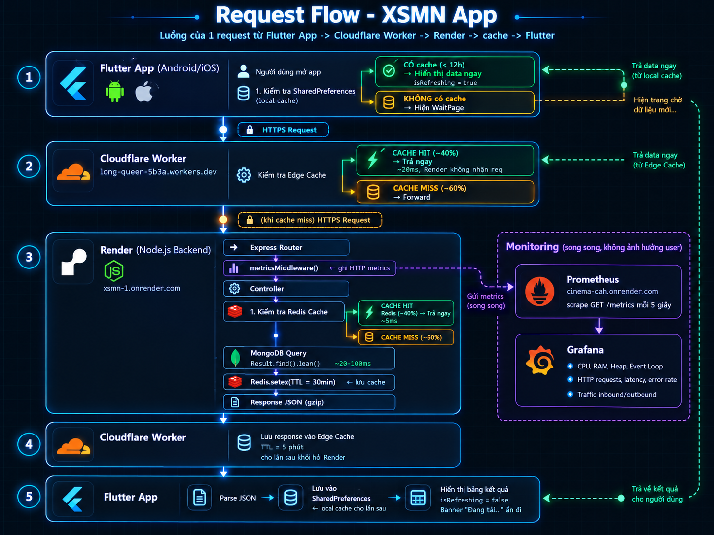
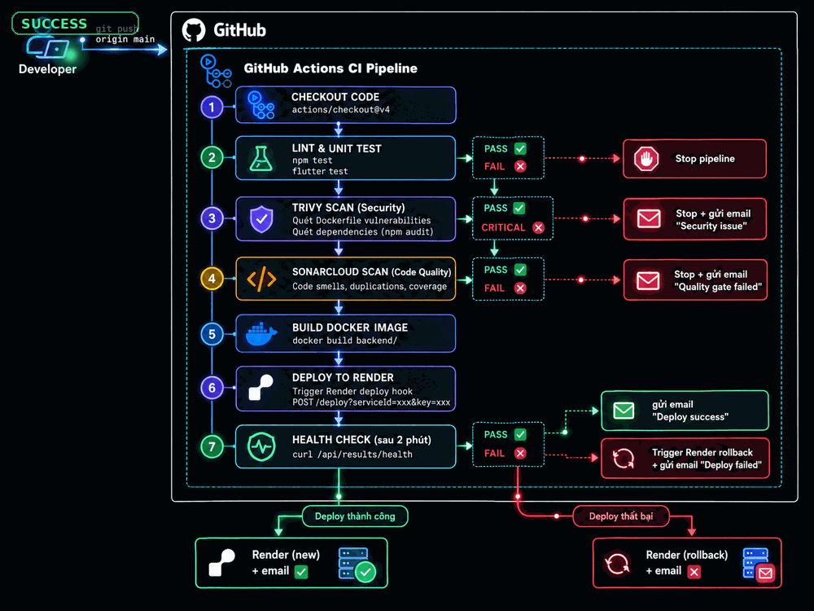

# 🎰 Xổ Số Miền Nam

Ứng dụng tra cứu kết quả xổ số miền Nam, gồm **Backend API**, **Crawl Service**, **Frontend Flutter** và hệ thống **Monitoring + CI/CD** đầy đủ.

[](https://github.com/LeVanAnUITK19/XSMN/actions/workflows/ci.yml)
[](https://sonarcloud.io/summary/new_code?id=LeVanAnUITK19_XSMN)
[](https://sonarcloud.io/summary/new_code?id=LeVanAnUITK19_XSMN)

---

## Mục lục

- [Kiến trúc hệ thống](#kiến-trúc-hệ-thống)
- [Luồng xử lý request](#luồng-xử-lý-request)
- [CI/CD Pipeline](#cicd-pipeline)
- [Backend](#backend)
- [Crawl Service](#crawl-service)
- [Frontend](#frontend)
- [Monitoring](#monitoring)
- [Load Test](#load-test)
- [Docker](#docker)
- [Deploy lên Render](#deploy-lên-render)

---

## Kiến trúc hệ thống

```
XSMN/
├── backend/        # REST API — Node.js + Express + MongoDB + Redis
├── crawl/          # Crawl service — Puppeteer
├── frontend/       # Flutter app (Android/iOS)
├── observability/  # Prometheus + Grafana
├── test/           # k6 load test
└── docs/           # Tài liệu và diagrams
```

**Stack công nghệ:**

| Layer | Công nghệ |
|-------|-----------|
| API | Node.js 20, Express 5, ES Modules |
| Database | MongoDB Atlas (Mongoose) |
| Cache | Redis (Upstash/ioredis) |
| CDN | Cloudflare Workers |
| Frontend | Flutter (Android/iOS) |
| Monitoring | Prometheus + Grafana + prom-client |
| CI/CD | GitHub Actions |
| Security scan | Trivy + SonarCloud |
| Deploy | Render.com |

---

## Luồng xử lý request



**Tóm tắt luồng:**

```
Flutter App
    │
    ├── Có local cache (SharedPreferences < 12h)?
    │   ├── CÓ  → Hiển thị ngay + fetch ngầm ở background
    │   └── KHÔNG → Hiện WaitPage → fetch API
    │
    ▼
Cloudflare Worker (CDN)
    │
    ├── Edge cache HIT (~40%)  → Trả ngay ~20ms
    └── Edge cache MISS (~60%) → Forward đến Render
            │
            ▼
        Render Backend (Node.js)
            │
            ├── Redis cache HIT  → Trả ngay ~5ms
            └── Redis cache MISS → Query MongoDB → lưu Redis → trả về
```

**Kết quả load test (1000 concurrent users qua Cloudflare):**

| Metric | Giá trị |
|--------|---------|
| Req/sec | 849 |
| Avg Latency | 301ms |
| P95 Latency | 900ms |
| Error Rate | 0.01% |

---

## CI/CD Pipeline



**Luồng khi push lên `main`:**

```
git push main
    │
    ├── 🧪 Test      — node --test (unit tests)
    │
    ├── 🔒 Trivy     — scan vulnerabilities Dockerfile + dependencies
    │
    ├── 📊 SonarCloud — code quality, security hotspots
    │
    ├── 🚀 Deploy    — trigger Render deploy hook (chỉ service có thay đổi)
    │       │
    │       ├── backend/**    → deploy Backend
    │       └── observability/** → deploy Prometheus + Grafana
    │
    └── 📧 Notify   — gửi email kết quả deploy
            ├── ✅ Thành công → "Deploy thành công"
            └── ❌ Thất bại  → "Deploy thất bại — Render đã rollback"
```

**GitHub Secrets cần thiết:**

| Secret | Mô tả |
|--------|-------|
| `RENDER_DEPLOY_HOOK_BACKEND` | Deploy hook URL của Backend service |
| `RENDER_DEPLOY_HOOK_PROMETHEUS` | Deploy hook URL của Prometheus service |
| `RENDER_DEPLOY_HOOK_GRAFANA` | Deploy hook URL của Grafana service |
| `SONAR_TOKEN` | Token từ SonarCloud |
| `GMAIL_USERNAME` | Gmail để gửi email thông báo |
| `GMAIL_APP_PASSWORD` | Gmail App Password |

---

## Backend

### API Endpoints

| Method | Endpoint | Mô tả |
|--------|----------|-------|
| GET | `/api/results` | Lấy kết quả (pagination, Redis cache 30 phút) |
| GET | `/api/results/filter` | Lọc theo `region`, `date` |
| GET | `/api/results/filter-province` | Lọc theo `province`, `date` |
| POST | `/api/results` | Tạo mới kết quả |
| PUT | `/api/results` | Upsert kết quả (crawl dùng) |
| GET | `/api/results/health` | Health check |
| GET | `/metrics` | Prometheus metrics (Bearer token) |

**Query params:**
```
GET /api/results?page=1&limit=20
GET /api/results/filter?region=mien-nam&date=2026-09-27
GET /api/results/filter-province?province=TP.HCM&date=2026-09-27
```

### Cấu trúc dữ liệu

```json
{
  "date": "2026-09-27T00:00:00.000Z",
  "region": "mien-nam",
  "provinces": [
    {
      "province": "TP.HCM",
      "full": {
        "DB": ["123456"],
        "G1": ["12345"],
        "G2": ["12345"],
        "G3": ["12345", "67890"],
        "G4": ["..."],
        "G5": ["..."],
        "G6": ["..."],
        "G7": ["..."],
        "G8": ["..."]
      }
    }
  ]
}
```

### Cài đặt & chạy

```bash
cd backend
cp .env.example .env    # điền các biến môi trường
npm install
npm run dev             # development (nodemon)
npm start               # production
npm test                # chạy unit tests
```

### Biến môi trường (`backend/.env`)

```env
PORT=3000
MONGODB_CONNECTIONSTRING=mongodb+srv://...
REDIS_URL=rediss://...
METRICS_TOKEN=          # Bearer token bảo vệ /metrics
```

---

## Crawl Service

Crawl kết quả từ [xoso.com.vn](https://xoso.com.vn) bằng Puppeteer, gửi lên API.

```bash
cd crawl
npm install
node crawlXSMN_POST.js  # Tạo mới kết quả hôm nay
node crawlXSMN_PUT.js   # Upsert kết quả hôm nay
```

Chạy tự động qua **GitHub Actions** (`.github/workflows/cron_job_post.yml`) theo lịch hàng ngày lúc 14:00–14:45 (UTC+7).

---

## Frontend

Ứng dụng Flutter cho Android/iOS.

**Tính năng:**
- Xem kết quả xổ số miền Nam theo ngày
- Vuốt trái/phải để chuyển ngày
- Lọc hiển thị: đầy đủ / 3 số / 2 số
- Dò vé số 6 chữ số tự động (G8 → ĐB, kèm tính thuế TNCN)
- Chia sẻ kết quả dạng ảnh
- Cache local (offline mode)
- Native splash screen

**Chạy:**
```bash
cd frontend
flutter pub get
flutter run
```

**Build release APK:**
```bash
flutter build apk --release
```

---

## Monitoring

Hệ thống monitoring gồm Prometheus + Grafana, deploy trên Render.

**Metrics được theo dõi:**

| Nhóm | Metrics |
|------|---------|
| System | CPU, RSS Memory, Heap Used/Total, Event Loop Lag |
| HTTP | Requests/sec, Latency (P50/P90/P95/P99), Error Rate |
| Traffic | Inbound/Outbound bytes/sec |
| Endpoints | Top routes, slowest routes, most errors |

**Chạy monitoring local:**
```bash
cd observability
cp .env.example .env    # điền GF_SECURITY_ADMIN_PASSWORD
docker compose --env-file .env up -d
```

| Service | URL |
|---------|-----|
| Prometheus | http://localhost:9090 |
| Grafana | http://localhost:3000 |

Xem thêm: [observability/README.md](observability/README.md)

---

## Load Test

Dùng [k6](https://k6.io) để test chịu tải.

```bash
# Cài k6
winget install k6 --source winget

# Test bình thường (30 VUs)
k6 run test/test.js

# Stress test (đến 1000 VUs)
k6 run -e MODE=stress test/test.js

# Spike test (đột biến traffic)
k6 run -e MODE=spike test/test.js

# Test local
k6 run -e BASE_URL=http://localhost:3000 test/test.js
```

**Kết quả tóm tắt (qua Cloudflare, 1000 VUs):**

```
✅ 0–500 VUs   → P95 < 500ms,  error ~0%
✅ 500–800 VUs → P95 < 900ms,  error ~0%
⚠️  800–1000 VUs → P95 ~900ms, timeout nhỏ
Peak: 849 req/sec, 194,678 total requests
```

---

## Docker

Chạy toàn bộ stack local:

```bash
# Backend + MongoDB + Redis
docker compose up -d --build

# Kiểm tra
docker compose ps
curl http://localhost:3000/api/results/health

# Chạy crawler
docker compose --profile crawler run --rm crawl-put
docker compose --profile crawler run --rm crawl-post

# Dừng
docker compose down

# Dừng và xóa volumes
docker compose down -v
```

---

## Deploy lên Render

**3 services cần deploy:**

| Service | Root Directory | Env vars quan trọng |
|---------|---------------|---------------------|
| Backend | `backend/` | `MONGODB_CONNECTIONSTRING`, `REDIS_URL`, `METRICS_TOKEN` |
| Prometheus | `observability/prometheus/` | `BACKEND_TARGET`, `METRICS_TOKEN` |
| Grafana | `observability/grafana/` | `GF_SECURITY_ADMIN_PASSWORD`, `GF_PROMETHEUS_URL` |

**URL production:**
- Backend: https://xsmn-1.onrender.com
- CDN (Cloudflare Worker): https://long-queen-5b3a.levanan1902006.workers.dev

> ⚠️ Render free tier: service sẽ sleep sau 15 phút không có traffic. Data Prometheus mất khi redeploy (ephemeral storage).
